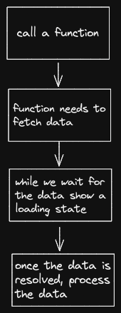
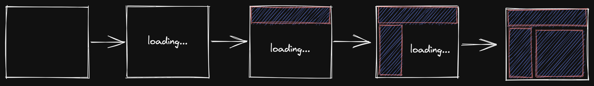
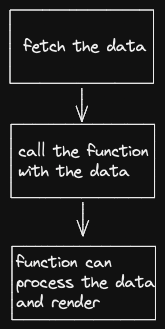

# React + React Router 6.4+ + ???

## When to Fetch

When to fetch data has always been a debatable topic in a single-page application. There are multiple ways to fetch data. They are

1. Fetch-On-Render
2. Fetch-Then-Render
3. Render-As-You-fetch (out of scope for this talk)

### Fetch-On-Render

This is the classic way of fetching in a SPA, we first render a component, and that component will initiate the fetches for fetching the data.

The biggest drawback of the approach is it leads to a fetch waterfall. This is because when a component higher up in the tree is fetching, it blocks the child components from rendering, thus blocking the initiation of fetch.

Another example (which might look familiar 😅)

We can safely say that Fetch-On-Render will not lead to a good user experience because the users see a lot of loading states when they use the application.

_think about how can we handle mutations_

### Fetch-Then-Render

In this paradigm, we fetch the required data to render the UI, and then we render the UI. This has been the way to build a web application for decades until we moved from MPAs to SPAs. The shift in fetching the data has more to do with the concept of "components", where the UI, styling, logic, and data are encapsulated into a single entity.

_okay, but when and how should we fetch?_

We should always fetch on route transition!

Okay, enough of the boring stuff. Let's look at some code and examples!
